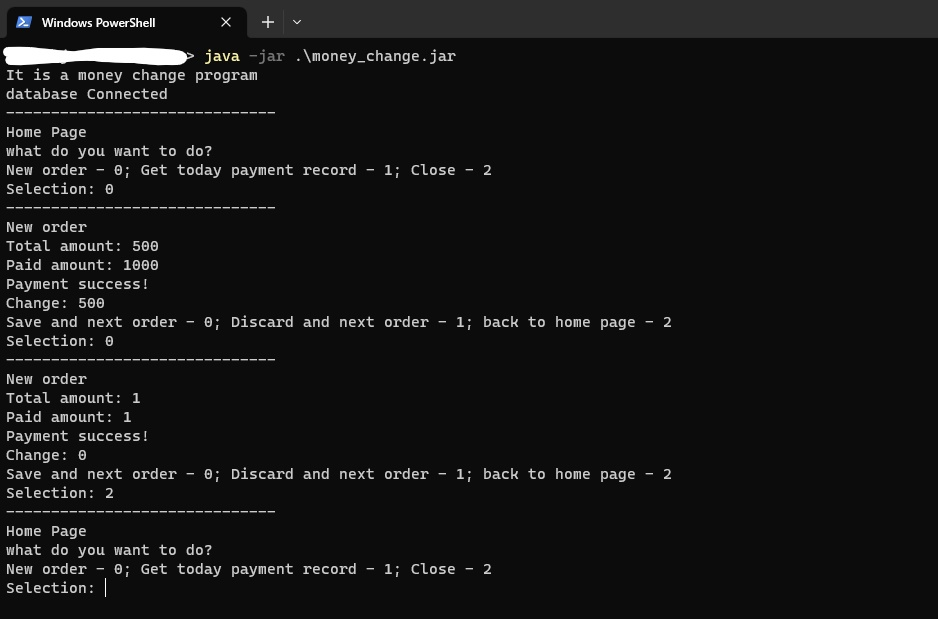
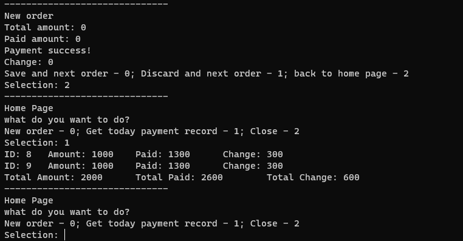
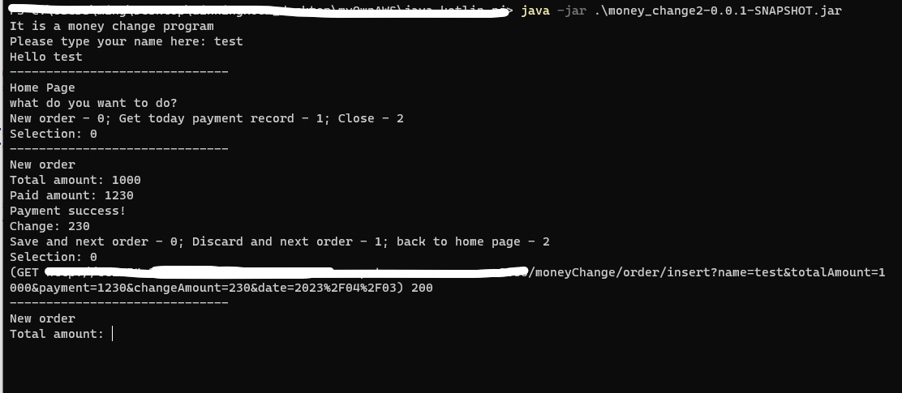
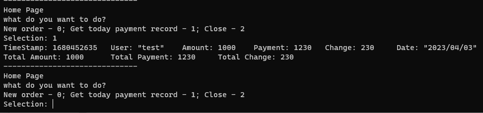

# my-projectsssss

make a record of my projects

## money_change 

It is a java program i wrote during my first year in IVE, it allows me and my colleagues not to calculate every order with a broken calculator or windows calculator which is hard to use,
and to save orders to database (i use mysql for this) so that we can settle accounts and go back home 
faster than ever : )

## money_change2 and money_change_backend

The first version requires an installation of mysql server before using, which is not convenient.  
Also recently i have learnt something about REST api, and started to learn kotlin, so i decided to re-write this application. 

'money_change_backend' is a java spring boot api that saves and gets data from mongodb by http request, and 
'money_change2' is a kotlin version of 'money_change' and implements the api, so it is a online version of money_change1.  
Also i have learnt how to build and make executable jar file from gradle (kotlin)

## upload_download_file_2_server

This is also a spring boot api project, it provide a gateway to upload and download file from remote server.

## simple building management program (with oop design pattern)

This is one of the school java assignments, it implements command pattern, factory pattern and memento pattern, it provides undo function.

## javaEE_project (not finished)

This is one of the school java assignments, it is a CRUD web application that implements javaEE 6.

